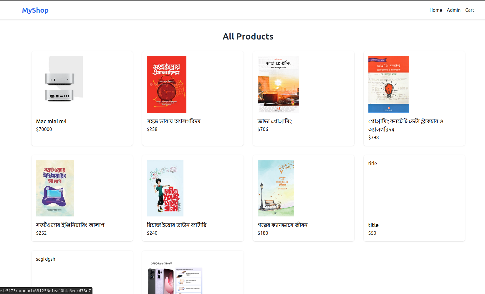
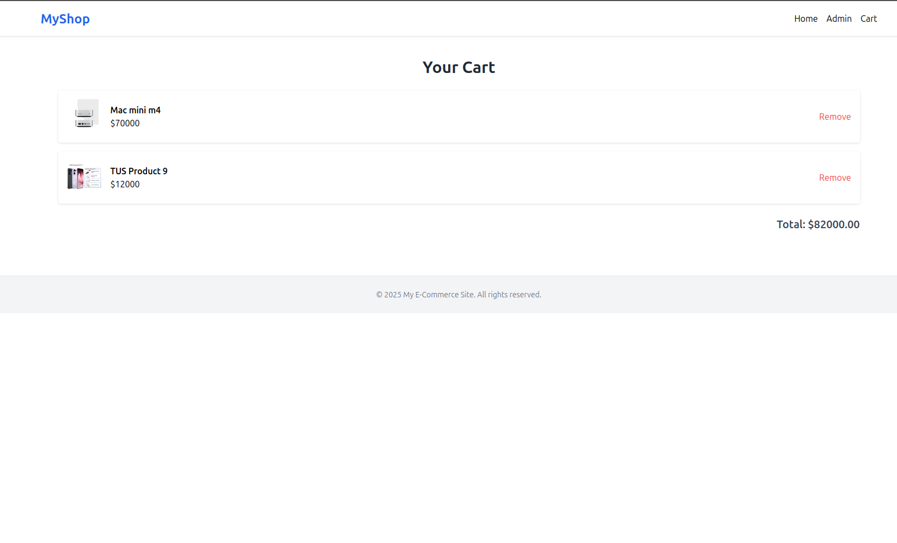
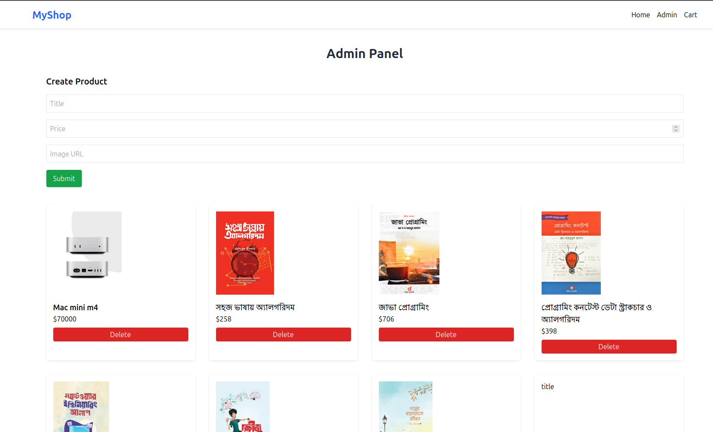

# 🛍️ React E-Commerce App with Tailwind CSS

This is a fully responsive e-commerce web application built with **React** and **Tailwind CSS**, integrating a REST API provided for Ostad's Module 10 assignment.

---

## 🚀 Live Demo

🔗 **Deployed URL:** _[[Netlify link](https://regal-selkie-430bed.netlify.app/)]_

🔗 **GitHub Repository:** _[[GitHub repo link](https://github.com/ob1Kenoobi/ecommerce-ostad.git)]_

---

## 📸 Screenshots

### 🏠 Home Page



### 🛒 Cart Page



### 🛠 Admin Panel



## 📦 Features

- 🛒 View all products from API
- 🔍 View product details
- ➕ Add products to cart
- ❌ Remove items from cart
- 🛠 Admin Panel for:
  - ➕ Create product
  - ❌ Delete product
- ⚡ Fully responsive design using Tailwind CSS
- ✅ Clean and modular React components

---

## 📁 Project Structure

src/
├── api/ # API integration (CRUD & cart)
├── components/ # Reusable components (Header, Footer, Cards)
├── pages/ # Pages: Home, ProductDetails, CartPage, Admin
└── App.jsx # App routing

---

## 🧑‍💻 Technologies Used

- **React**
- **Tailwind CSS**
- **Axios**
- **React Router**
- **Render-hosted REST API**
- Deployed on **Vercel** or **Netlify**

---

## 🛠 Setup & Run Locally

1. Clone the repository:

   ```bash
   git clone https://github.com/your-username/your-repo-name.git
   cd your-repo-name
   ```

2. Install dependencies:

   ```bash
   npm install

   ```

3. Add a valid JWT token in src/api/api.js:

   ```bash
   const TOKEN = "<YOUR_VALID_JWT_TOKEN>";

   ```

4. Start the development server:

   ```bash
   npm run dev

   ```

## 📌 Notes

<ul>
  <li>If API returns jwt expired, generate a new token via Postman.</li>
  <li>You can add a basic login mechanism if needed to dynamically fetch token.</li>
</ul>
